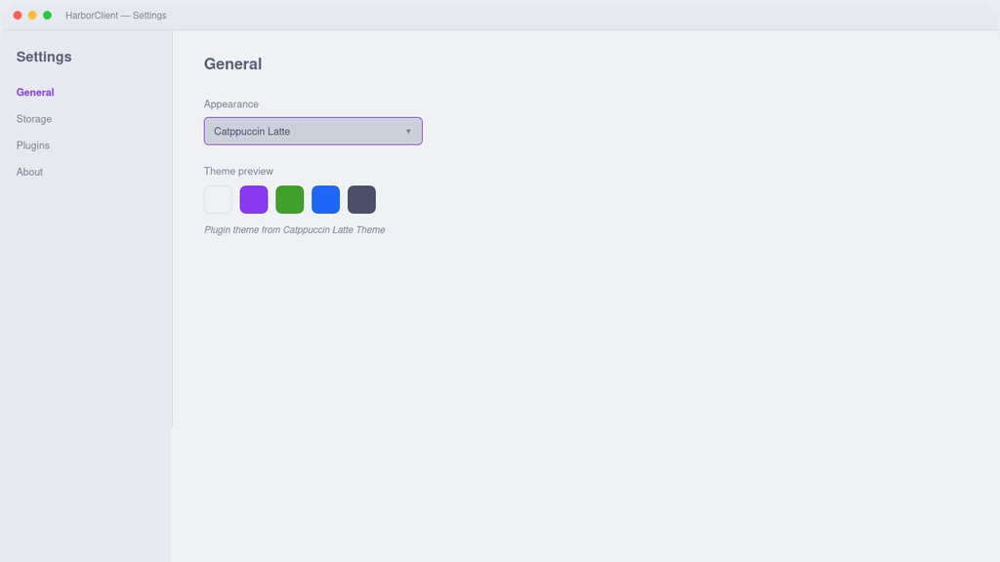

# Catppuccin Latte Theme

Adds **Catppuccin Latte** to **View → Theme** and **Settings → General → Appearance**
with token overrides and a bundled stylesheet (pastel gradients, scrollbars, and
focus rings).



This is a JSON-only theme plugin: HarborClient loads the palette from
`exported.json` via `contributes.themes[].import`. No JavaScript entry or build
step is required.

## Permissions

- `ui` — theme registration

## Package layout

```
catppuccin-latte/
├── manifest.json      # contributes.themes[].import → exported.json
├── exported.json      # harborclientExport: "theme" envelope
├── styles.css         # referenced by exported.json stylesheet (inlined on first read)
├── README.md
├── screenshot.png
└── signature.json     # publisher signature (from pnpm release)
```

On first read, HarborClient inlines `styles.css` into `exported.json`'s
`stylesheet` field so the theme becomes a single self-contained file afterward.

## Usage

Enable the plugin, then choose **Catppuccin Latte** from the Appearance dropdown.

Requires HarborClient `>=2.5.0` (theme JSON import).

## Development

1. In HarborClient, open **File → Themes** (or **Settings → Plugins**) → **Load unpacked…** and select this project folder
2. Enable the plugin and select **Catppuccin Latte** under **View → Theme** or **Settings → General → Appearance**

Edit colors in `exported.json` or rules in `styles.css`, then reload the unpacked
plugin to preview changes. No `pnpm build` is needed. After the first load
inlines the CSS, edit the inlined `stylesheet` string in `exported.json` (or
restore `"stylesheet": "styles.css"` and keep a sibling CSS file for iteration).

## Packaging

```bash
pnpm pack
```

Creates `../catppuccin-latte.hcp` with `manifest.json`, `exported.json`,
`styles.css`, `README.md`, `screenshot.png`, and `signature.json`.

To bump the version, resign, commit, and tag:

```bash
pnpm release
```
